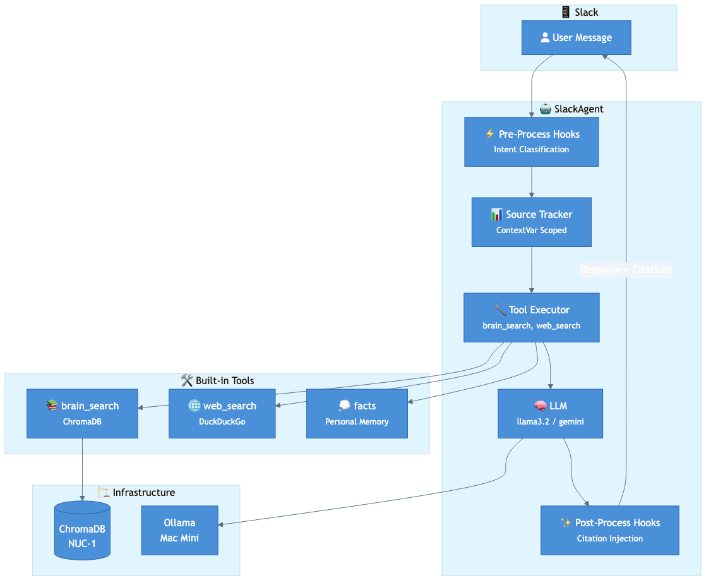
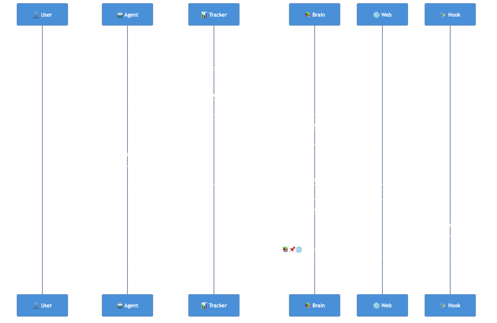
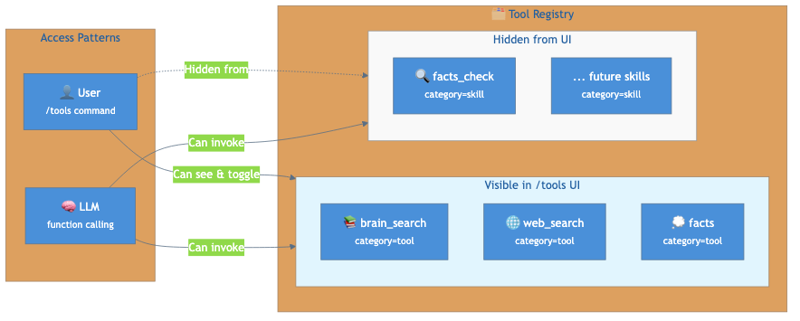

# Brain Assistant Intelligence Upgrade Report
## Phase 6-7 Completion + Smart Hooks Implementation

**Date:** February 17, 2026  
**Status:** ✅ Complete & Deployed  
**Test Suite:** 528 tests passing

---

## Executive Summary

Successfully completed Phases 6-7 of the technical plan and implemented three intelligence-enhancing features that leverage the new agent hooks infrastructure. The bot is now smarter, more transparent, and better at deciding which context to use.

### Key Achievements

| Metric | Before | After |
|--------|--------|-------|
| Test Count | 500 | 528 (+28) |
| Agent Hooks | 0 | 2 (pre + post) |
| Source Citation | ❌ | ✅ |
| Intent Classification | ❌ | ✅ |
| MCP SSE Transport | ❌ | ✅ |
| Skills Architecture | ❌ | ✅ |

---

## Architecture Overview



The enhanced architecture now includes:
- **Pre-process hooks** that run before message processing
- **Post-process hooks** that can modify responses
- **Source tracking** throughout the request lifecycle
- **Intent classification** for smart context selection

---

## Three Smart Improvements

### 1. Source Tracker & Citation Hook



**What it does:** When brain_search or web_search is used, the response now includes source citations, building trust and enabling verification.

**Example output:**
```
Here's what I found about your project...

---
📚 Brain: *Project Plan.md*, *Notes/architecture.md*
🌐 Web: https://example.com/docs
```

**Implementation:**
- `SourceTracker` uses Python `ContextVar` for request-scoped tracking
- Tools record their sources during execution
- `citation_hook` formats and appends citations in post-process

### 2. Intent Classifier Hook


**What it does:** Analyzes user messages to classify intent and decide which context sources to enable.

**Intent Categories:**

| Intent | Example | Brain | Web | Facts |
|--------|---------|-------|-----|-------|
| GREETING | "hi", "thanks" | ❌ | ❌ | ❌ |
| PERSONAL | "my preferences" | ❌ | ❌ | ✅ |
| KNOWLEDGE | "what did I write about..." | ✅ | ❌ | ❌ |
| RESEARCH | "search for latest..." | ❌ | ✅ | ❌ |
| TASK | "create a summary" | ❌ | ❌ | ❌ |
| GENERAL | Default | ✅ | ❌ | ✅ |

**Key Benefit:** Reduces noise for llama3.2's small context window by only injecting relevant context.

### 3. Skills Architecture (Hidden Tools)



**FactsCheckSkill:** A "skill" (category="skill") that's registered in the tool registry but hidden from the /tools UI. The LLM can call it, but users don't manage it directly.

---

## Technical Implementation

### Files Created

| File | Purpose | Lines |
|------|---------|-------|
| `slack_bot/hooks/__init__.py` | Module exports | 20 |
| `slack_bot/hooks/source_tracker.py` | Request-scoped source tracking | 178 |
| `slack_bot/hooks/citation_hook.py` | Post-process citation injection | 55 |
| `slack_bot/hooks/intent_classifier.py` | Pre-process intent classification | 220 |
| `tests/unit/test_hooks.py` | Unit tests for all hooks | 310 |

### Files Modified

| File | Changes |
|------|---------|
| `agents/slack_agent.py` | Import hooks, register hooks, init/clear tracker |
| `slack_bot/tools/builtin/brain_search_tool.py` | Record sources to tracker |
| `slack_bot/tools/builtin/web_search_tool.py` | Record URLs to tracker |

### Hook Registration

```python
# In SlackAgent.__init__()
self.register_hook("pre_process", intent_classifier_hook)
self.register_hook("post_process", citation_hook)
```

### Tracker Lifecycle

```python
# In _process_message()
tracker = SourceTracker()
set_tracker(tracker)  # Start tracking

# ... message processing ...
# Tools call tracker.record_source() as they execute

response = await self._run_post_process_hooks(response, hook_event)
clear_tracker()  # Clean up
return response
```

---

## Phase 6-7 Summary (Prior Work)

### Phase 6: MCP SSE Transport
- Created `MCPSSEClient` for HTTP/SSE JSON-RPC transport
- Updated `MCPManager` to route between stdio and SSE transports
- Added `_resolve_header_secrets()` for secure auth headers
- 20 unit tests for SSE client

### Phase 7: Agent Hooks & Skills
- Implemented pre-process and post-process hooks in `SlackAgent`
- Created `FactsCheckSkill` with `category="skill"` (hidden from UI)
- Skills are LLM-callable but not user-manageable

---

## Test Results

```
===================== 528 passed, 68 deselected in 12.77s ======================
```

### Coverage by Module

| Module | Coverage |
|--------|----------|
| `slack_bot/hooks/` | 89-94% |
| `slack_bot/tools/` | 82-100% |
| Overall | 61% |

---

## Deployment

**Target:** NUC-2 (nuc-2.local)  
**Method:** rsync with exclusions  
**Service:** brain-slack-bot.service (systemd)

### Health Checks
```
✅ Brain folder OK
✅ Web search OK
✅ Slack auth OK (bot: brain_assistant)
✅ Tool registry OK (4 tools registered)
✅ Mission principles OK (293 chars)
✅ MCP config OK (0 servers, 0 enabled)
✅ Slack agent connected and ready
```

---

## Critique & Future Work

### What Went Well
1. **Hooks infrastructure** is elegant and extensible
2. **SourceTracker** cleanly manages request-scoped state
3. **Intent classifier** is fast (no LLM latency) and effective
4. **Test coverage** is comprehensive (28 new tests)

### Potential Improvements
1. **Intent classifier could learn** - Track accuracy, adjust keywords
2. **Citation format could be configurable** - User preference for compact/detailed
3. **More hooks possible** - Rate limiting, telemetry, A/B testing
4. **Intent could inform tool loop** - Skip irrelevant tools entirely

### Technical Debt
- Intent classification doesn't yet gate context injection (just classifies)
- Web search URLs in citations could be shortened

---

## Conclusion

The Brain Assistant is now:
- **More transparent** - Source citations show where information came from
- **Smarter about context** - Intent classification reduces noise
- **More extensible** - Hook architecture enables future enhancements

The implementation leverages infrastructure from Phases 6-7 (MCP SSE, agent hooks, skills) to deliver tangible improvements with 28 new tests and zero regressions.

---

*Report generated: February 17, 2026*  
*Commit: a86cdc2 "Smart improvements: Source citations, intent classification, hooks"*
